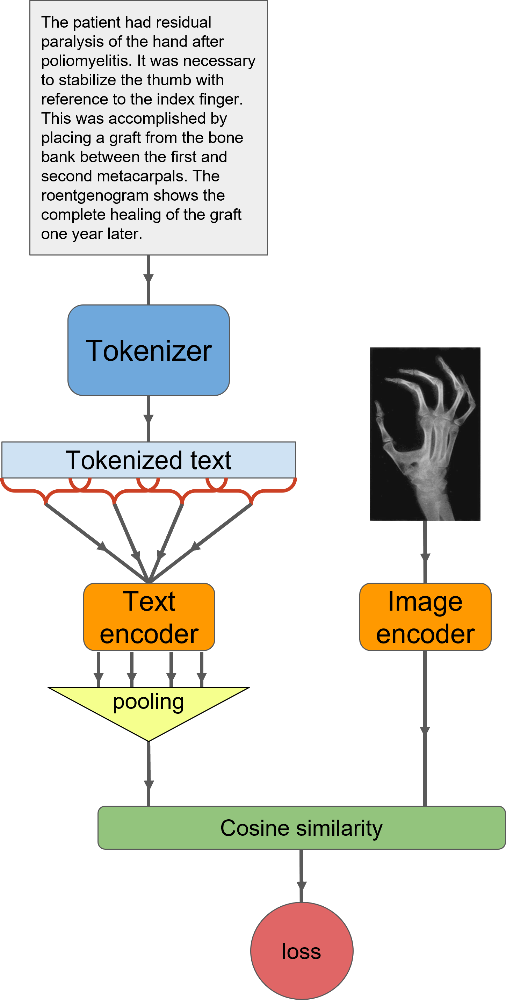

# ClipMD
ClipMD is a medical image-text matching model based on OpenAI's CLIP ViT32 model with a sliding window text encoder. ClipMD was fine-tuned on the [ROCO dataset](https://github.com/razorx89/roco-dataset). 
* [ClipMD pretrained model on Hugging Face](https://huggingface.co/Idan0405/ClipMD). Trained weights are also included in this repository.
* [ClipMD paper on arxiv](https://arxiv.org/abs/2303.13340)

# Approach
<p align="center">
  
</p>

# Usage
First, download the ROCO dataset, clone this repository, and run:
```bash
pip install -r requirement.txt
```

To train the model on the ROCO dataset run:
```bash
python train.py PATH_TO_ROCO_ALLDATA
```

To test the model on the ROCO dataset run:
```bash
python recall_at_k.py PATH_TO_ROCO_ALLDATA
```

